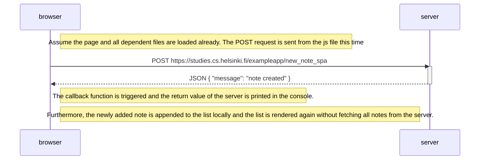

```mermaid
sequenceDiagram
    participant browser
    participant server

    Note right of browser: Assume the page and all dependent files are loaded already. The POST request is sent from the js file this time

    browser->>server: POST https://studies.cs.helsinki.fi/exampleapp/new_note_spa
    activate server
    server-->>browser: JSON { "message": "note created" }
    deactivate server

    Note right of browser: The callback function is triggered and the return value of the server is printed in the console.
    Note right of browser: Furthermore, the newly added note is appended to the list locally and the list is rendered again without fetching all notes from the server.
```
